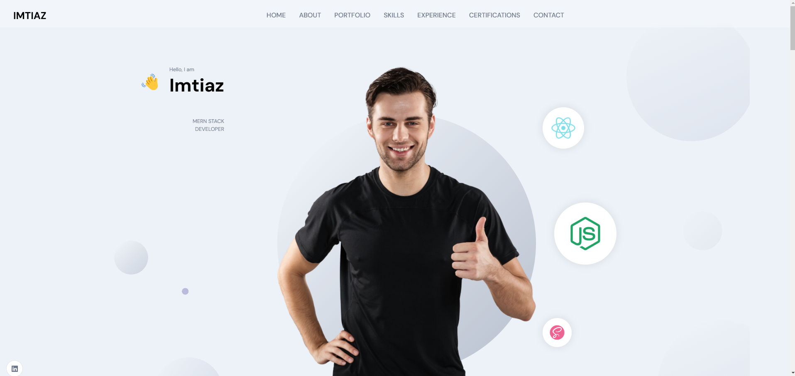
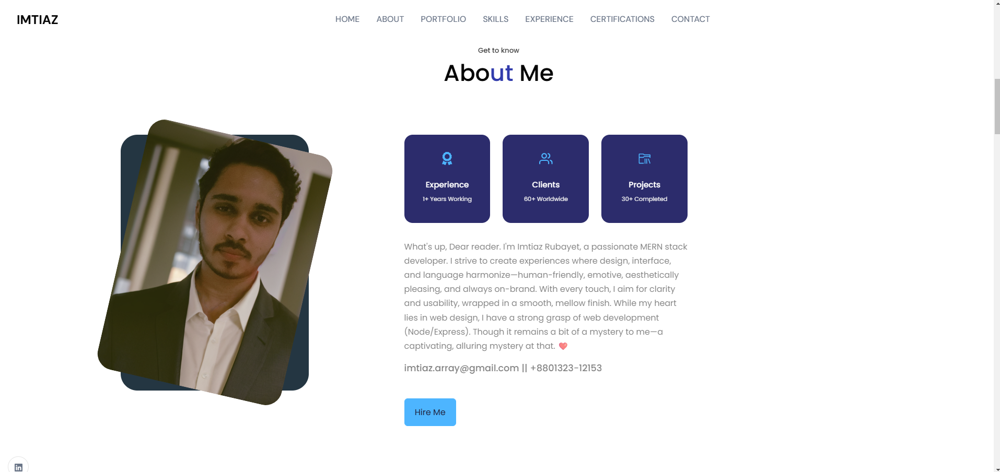
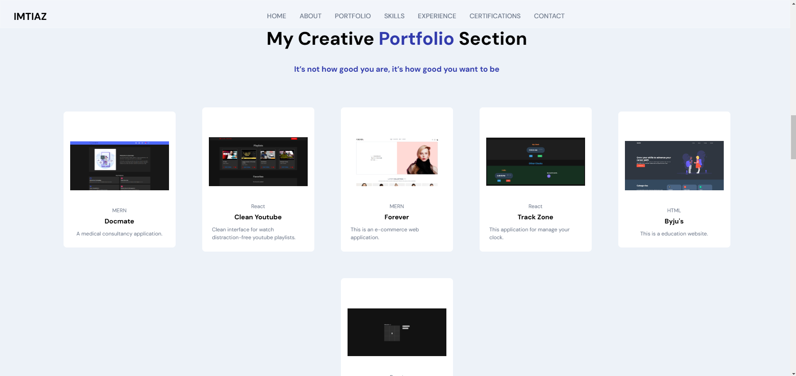
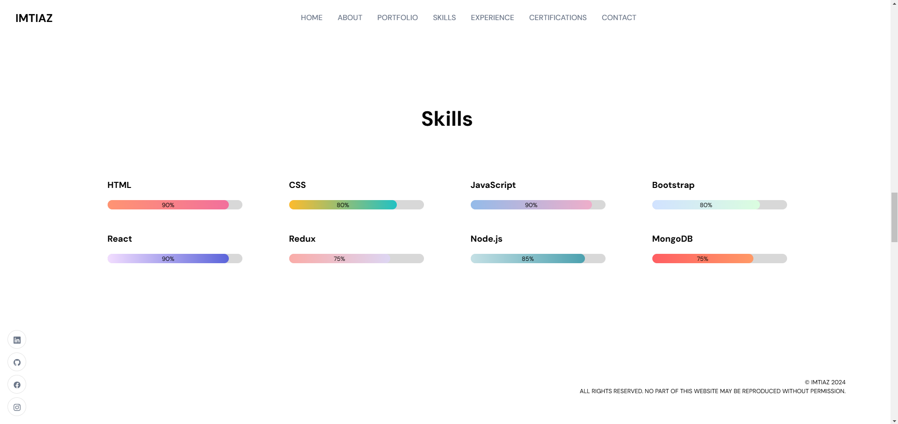
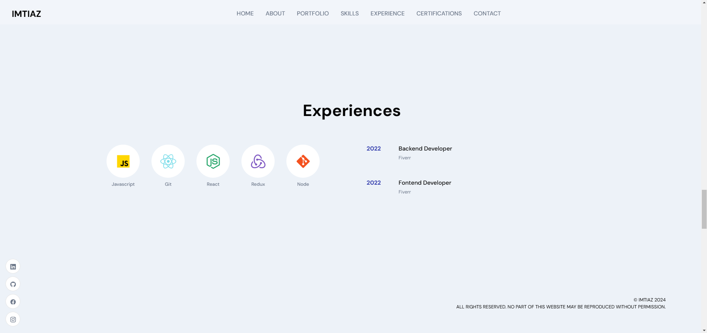
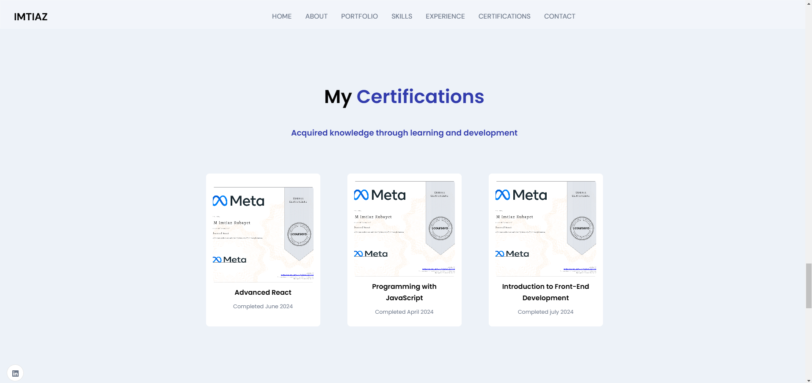
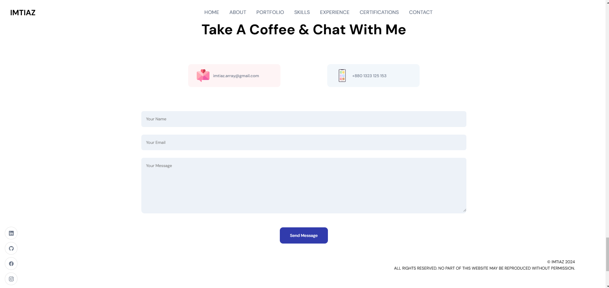

# Personal Portfolio Website

This is a personal portfolio website developed using React and SCSS. It highlights projects, skills, experience, certifications and contact information in a clean, responsive layout.

## Features

- **Home Section:**
  - A page for greetings.
- **About Section:**
  - Introduction and brief bio.
- **Portfolio Section:**

  - Showcases portfolio projects with descriptions, tech stack, and links to live demos and source code.

- **Skills Section:**

  - Displays technical skills with visual indicators of proficiency.

- **Experience Section:**

  - Lists previous work experience.

- **Certifications Section:**

  - Lists of some certificates.

- **Contact Section:**
  - Form to contact via email or direct links to social media profiles.

## Tech Stack

- **Frontend:** React, SCSS for styling
- **Deployment:** Vercel

## Installation

1. Clone the repository:

   ```bash
   git clone https://github.com/Imtiaz4530/personal-portfolio
   ```

2. Navigate to the project folder and install dependencies:

   ```bash
   cd personal-portfolio
   npm install or yarn
   ```

3. Start the application locally:

   ```bash
   npm run dev or yarn dev
   ```

4. Open the browser and navigate to `http://localhost:5173` (or specified port).

## Screenshots

### Home Section



### About Section



### Portfolio Section



### Skills Section



### Experiences Section



### Certifications Section



### Contact Section



## Contributing

If you would like to contribute, feel free to open an issue or submit a pull request.
